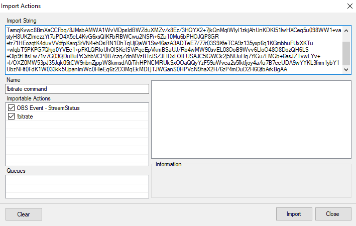
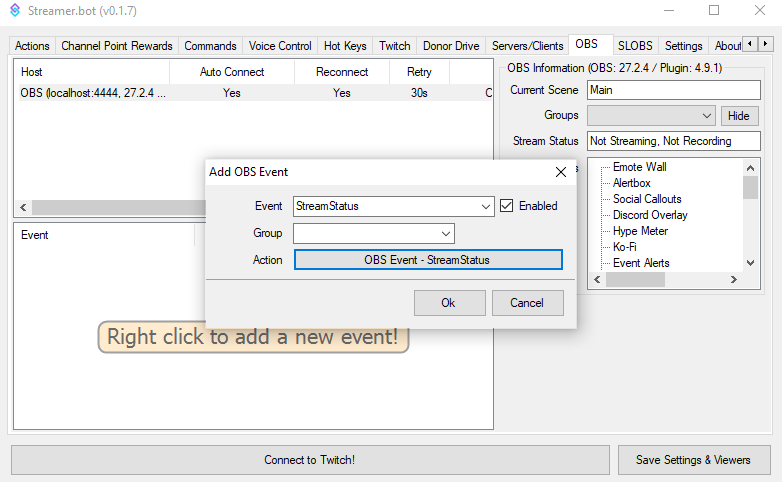
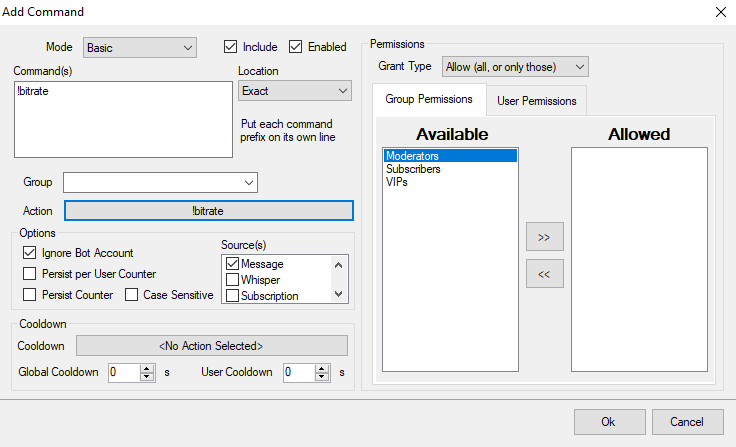

*OBS WS v4.9*{.obs-version-badge} 
## Import Code
```
TlM0RR+LCAAAAAAABADNVLFu2zAQ3Qv0H1QB2cyAlChZ7JYURYYCLVAXWYoMR/IUC5UlV6ScBIH/vaRkwbKtDEYaIJOoe8d3vHePfP74IQjCDTamqKvwc8BmXaCCFbq/8JMsbAMWA1WvVlDpsIdBWZduXMZv/x8Ez/3HQYX2+7jkQnMqiWIyI1zkjAhUnKDKI51lwHXCeq5u098WW1+vastyH8UKZImezzYt7uPD4X5cL4KvG6xsQIKFbRBWCwu2NSPi+6Zu10Mu6bPHOJQP8GR+tr71HEozqtK4duvVVdfpKarqSrVN4+hOsRN1DhTqUjQaW1Sw46azA3ADTeE7/77r03S9XfeTCA9z135yxp6q1KGmbhuFUxXKTu+wlqbT5PKPG7Qhjo0YVEc1+pFKLQRIoUhOlSKcISViPqeEpVkmBSaUJ/Ro4wMW90svEL08OoB9Wvv6LIoO48O8DozQH6LS+Oip9tHtsLw71v7G03QDuBuPrCxhbVCP0B7czqZdnMVzBTrJSZJLIDxLOIFUSAJC5lGWCk2j5NUuHq7YlGu/LMGb+6asJZTvwLYv++l/OXZ0MW53pJ35Jqk05tCW9nbnZjppW8kimsdA0iTihHPNCMRUkSxOOaQQyYzF59uWvca2s5fktfjoy4a/lu7B7ccUDA9wYYKL3frim1ybY1UbzNHt0FdK1W033kk5UpanImWc0HieEq6z2D3MqEkMDLjTJWGanS0HPVcN9haX2H/6zP4mDuD2H6QtbArkBgAA
```

## Installation
In Streamer.bot in select `Import` from the top left.
Copy the `Import Code` and paste it into the `Import String`. 



## Configuration
Assign the `Action` `OBS Event - StreamStatus` to a `StreamStatus` `Event` in the `OBS` tab.


Next create a `Command` called `!bitrate` set to `Exact` and tied to the `!bitrate` `Action.


>Chat will now be able to use `!bitrate` in chat and have the current bitrate displayed.
{.is-info}

# Contributors

 - [<i class="mdi mdi-twitch"></i> WaldoAndFriends](https://www.twitch.tv/WaldoAndFriends)
 {.contributors}