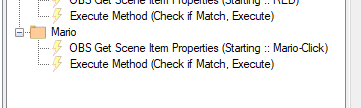

# Import Code
```
TlM0RR+LCAAAAAAABADVV1lv2zgQfl9g/4PXQN7KgKQoWeqb4zSJ0zjNUR/xeh94ytroWh123KL/fSnJTmzZbWPAbVEBsSLOcGb4cb4Z8vOffzQazZlMUi8Km28b+E05ENJA6q9ms/qkPNPiVI/8XXw3Gp+rlxZ5otAzILVtyi0AETIAgcoBzKY2sCR2BHMktaFZ2Son/ZfLvLAf5r7/MipDynxZ2MuSXK6NP3E/F/IsiYILL82iZKFVFPXTNZ1VwD2aeBFA/Zs1b24S5XEhvJA069G40V4u50WF+nO6SO/ycNtyQkMRBdWUbSmPQp4niQyzbdkWahvIlSpCzjy+hUQpSqM8FGeeXy6r83Yy6ad6lyaTLIyjbDLp5anHJ5OgWi/I4+MgNpqbJpQXeun0RKookZ0ozLww90J3K9BSdxb5eQkhPMZ4U1RtsUVES0gLA6pMBQhRAjDV0vuMTEFsy2Lc4TX/c+m506y0CTcl2SIufKHN0eeNqtn5SmJUwYVCPhWmXka/vPka3Jl8KsJpHuUay6OGG2UN2kB53MimctEIo3ljSmeycVSieuXNZHrUKF9/1SKKE6mk3nbR5lzvU7nGXaA5iDEBDRsoSjUvTKHhY1AB2mKEIY2nwvVN+z5o8HComa9BbbMYPA8LmfLEi5e8qEsfpYzbvsZud7qV+MmQyxo9SmGR7UMdYjTX+d7zeBKlkcqOr999nEzOEh3NPEoeLTKZzMgxPDaggRzNhJRHie+xY+H7zXWD/2x6ZotMk0GUKxKj65gF3O0b/idxPsg+zOH709t4LoaXKR323Af8NOVGz71FJ937oanHTF/LW6e3kdvttF1+MfDYuf9v9/xyxvDcvRtN/QdjAMf3brzSkdpm8a7+TvDDqOtqvz732k73/GwxNq5ZNxx8Go+63uje7DN0DXng5+OFG3/YnBuz8NbV/vB41HNv7tvzmjylo7HPF4Xdp1gEg0/dTlrGfvUofHFW+Lgcav+2Xge88aaI48HiqtP22PBsQYdOr5rfTbsXdwsx7Nf9L+2nSW38tP/Ozft4AAfFuvzxlH/L9jK2q84J5OHAf/8xve54K1vtKl7/2hfvCmwG2VjH+r5zmT2MLmMGl+vy5isc6jEuxqM7xAPiiotLNH62feLofXO2WcyjIK5q7I4kFdKni/uMJtvFvWJRyXHGsNJMJgAKDgHRhRDYtv7hNmSiRUylDGtfjjvFcziak9fQPOUylNdLrperLprFVlNK+LNS2Wx1+awrZTST2xVRt8pQli2xW+IGlw/Y8bN6mrsAtw0pjRYhgHJuAsIxBPqIofGXjEBkQYYl2hdw44BFFf4StNEPQtvA0hBKQYAspvu+RRRwIFYacgsjEylMkf0r0TZeg/aM+uWB04Q1zwF9GixlNUl17vsW8RWxHAyFDQg2ECC2aQBHH30B4rYwHX1WshTZv7lDfDhs8Bo2q39f2uHygHpeOCjb8JqIR75P41SKNWklXIFcvwIobhgKOTZg0LZ0nkgLMIxsQBG2iEUVbTn4J14BOr7HH3+PSwBdoylFSBGkLCDNgm3MZsBmlIKWUFggG3LE610sycNuEEihy4C/2J0OpWnEdGlsMQikEESbJkjvjYNBy8LKooYN7RbdN13J7lzdvs3sm63fZTIyDkdk00S8ZWrQDWZQQFTRUBgVQHMYOYi2OIV7N5TDEvlVLWWmE78wtWoYUSj7cTso7ydvdoNYL4fLkm8SSix9mGEm1A3WtFrAhhKCIkcUo1LY5t4nGoSNw8Gxftn70XVtP0b+nLomk9+jsq3u25f93s322ftVN2hoGMK2FQKKcQZIizrAdpQDDBMxaHBTCKEOdYP+VtnaVTx2kPNg2Vi8Ks0qpdam6mlBoLdtpf/lf0bFDfXFEwAA
```
# Installation
In Streamer.bot in select `Import` from the top left.
Copy the `Import Code` and paste it into the `Import String`. 
### Assets
Download the Assets here, extract them and put it somewhere safe.
[interactive-super-mario.zip](../assets/mario-clicker/interactive-super-mario.zip)

Here is the codepen Version https://codepen.io/terrierdarts/pen/ZErVvXV
Here is the Original Pen by MercheDev https://codepen.io/merchedev/pen/BaYqyNx. Thank You for the work.

Once you've imported the code and downloaded the assets you will need to add a browser source in OBS called Mario-Click. (This will be the index.html file found in the dist folder that has been extracted. 

Then in The `Heat Sources Logic` you will need to add actions that get the properties of the source it should look like this.


You will then need to add the 1up Gif to OBS if you wish to have it. 
Then finally tie all the Sub-Actions inside the `Mario1Up` Action to the correct sources and sound file.

The `Set Argument` Sub action in Mario-Click that value is of many coins equals a life.

> REMEMBER if it says `Someone has gained a life` this is because that user has not given heat access to their user ID.
{.is-danger}

> If you use a different websocket port that is different from the default one this will need editing in the script file.
{.is-warning}

# Contributors

 - [<i class="mdi mdi-twitch"></i> TerrierDarts](https://www.twitch.tv/TerrierDarts)
 - [<i class="mdi mdi-twitch"></i> Lyfesaver74](https://www.twitch.tv/Lyfesaver74)
 {.contributors}

