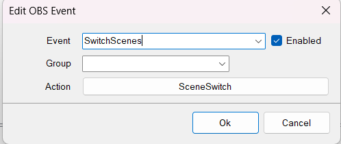
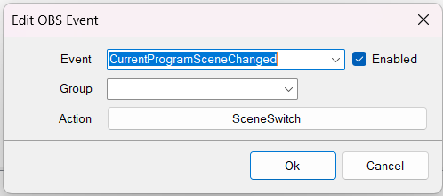

> This extension requires SB 0.1.14 to work. However there is a 0.1.12 Version at the bottom this wll be more like the example in the video.
{.is-info}


# Tutorial

<div class=“iframe-container”><iframe src="https://www.youtube.com/embed/9Gx7b46y0S8" title="YouTube video player" frameborder="0" allow="accelerometer; autoplay; clipboard-write; encrypted-media; gyroscope; picture-in-picture; fullscreen" allow fullscreen style="border: none; max-width: 100%; width: 100%; aspect-ratio: 16/9;"></iframe></div>

# Import Code
```
TlM0RR+LCAAAAAAABADlV1lz2zYQfu9M/wNHz4EHIA4SebOVxEcbJbZiy1aVBxxLijFFqjwkK5n894JkFEuy04lbN+O2HNMUsIvdxQL77e6nn3/yvN4CijLJs95zz3/WTmRqBm7U63VDZSpHLt3Mb83Y8z51H0dKbMNnbSSoNBoJEgJiREdIEmaRCS0NgTOljOxktYt+r6Fu5Gd1mt7OQqZ0Co28qqhhY/7GpLWFV0U+O0rKKi9WjiVSabnBszb4pC4rrz9VVZVk8YbGuMjrecMwNJDBcJlUZrpBVulSrcqzOrsruVCZzWf7rQfuUk2embooIKvu0u54bctzLUsFN83C3rtpUnru7xvmt7zzAiJwquy+MXndKsTbHN1Z+MwqaoVGKpARYoJrFPIIEIgoEoIBcMJ3RC8hiaetwL0dkdVq3viV7Eyv3bl1gH92iJ19mYWbRsvt7Odn33LNQqXtHekN8xk0PskySL23eZJVpfcm6923dSpDHgZKooBigpgmPpJaB4hxHAZY8lBqePjWsXzMzZPv2XxZqQqam/Pp87YUm5SNikFe9fMsSuK6aNVt37wNjzAFEeZGoMAARYxSimRgQiS58EUQMCKJeahHfEwf0yH+hkPWP9/vRtFho6INpfebwZemal6C3aB2xLXXdnGKhaHWMiDIaMucOwKMtMYhshZHHDNMTaR+CE61MPQCIlWn1dOHqa+xuJ+mu6GY3x+KmgohqVKIG2URC0SAlAGHQpgrw6SUlJF/RSjuQvTSobO3TJwjijpzI8i8VV57U7UAL8u9Eiqv86gX5YVXNdztYf5FNOd+6AvjN1dUSsRwwJACw9wFDrjA0peascdC817v4T78Lix/NDij1iprQ4yE9DlikQ6dN0Ai7UoMzkGGGtv/EZxhIagKOXUJXrh8JyOGpIo4Uio0vggZuDvy4+DsDlw9UTRzyzNo2Y47L3550D3/1s+9GEeCkASAA4R9MIhZnyAVNb+4ibAUmGDz4Nhkj3oZvys6t4v9r9MWSlMk8y9HsEu9Bpjvp8kC7g/XFt0gM7BzEi2x/3wyGTkT82U5mbxOTJGXeVTtDV6+m0xeFc6aZV5cCzaZLNge3qOYEjmZzEqTF2mi92ya9jYFvt/WrFcV9HPb7sheDuZ6ZuJzmn60hxfVmyX+5cXpfGlHJ6UavY6v/Jupoa/jU3JwPBxxN8dTRw9enObxcX8/NkcXiT5MPxwfniy0v4zPLqfpFb3A42E8X/OAk9l8u/fAv7o8jo0/SPXsPH47PJiamf04Wp18sJcnq/GI4/OOllwO+bkmA2xmaT1exfM323Lm42Q/b+z69frVB3uYLvT1BVOXjn81/XjlX9Tj4fVXG9r3qBz0k/3bcfO+HJwO+3xoR/zgip7Ntc/yL7bt6pNbsg4vSuOfb8nb3mf3tvalJ0SvbUzipNvfxcvxaDy1oxt8nFwH23biQT/e0r0aX54RM2OxPToh43frfTQ2zeXdvGny2TxJv3HxLKRqNaxUcRcbushoIzeUoEG4shgDbeKVShQSSxDBFusQU/DlgyNXNs8/VZ7845kEMxOxUCDuM4UY0xQpzQiiWoQRSBEBBD8mkzRH55pfb5hvVpZPNZfsVofVFLzbLfyNui8KhQ/ED1xpo7GrdALXxVtMUcTdubj+nkqym5SedBe/28BH0b0pNTKcUCYYohBpxHzGUEiJdnlV2EBhI3y+u/Bptg2PVvJiH7tGXURIS1dfsEC65t0FJMIuWiWDMHRt63+x5G0+HWeHNhtL3bLZzEX1mv/zHynsq/bGFAAA
```

# Installation
In Streamer.bot in select `Import` from the top left.
Copy the `Import Code` and paste it into the `Import String`.

Next thing to do is it tie the Action `SceneSwitch` to the swapping scene event in OBS which is differnet depending if you are using Websocket 4.9x or Websocket 5. 

If you use Websocket 4.9x you will need to set up the OBS event like in the video it should look like this. You will tie the `SwitchScenes` OBS Event.


If you are using Websocket 5 you will need to set up the OBS event not like in the video, instead you will use the Event `CurrentProgramSceneChanged`



After then you will need to create an actions that are named identically to your scenes. This will mean when you switch to a scene Streamer.bot will try run an action of the same name. If you switch to a scene called `Just Chatting` then Steamer.bot will try look for an action called `Just Chatting` if it exists it will run it. If the action doesnt exist it will run the action called `SceneDefault`. If you don't want a default action to happen this action can be deleted or disabled.

> The same effect can be acheived in UI with if statements as explained here https://wiki.streamer.bot/en/Broadcasters/OBS/Events/Scene-Events/CurrentProgramSceneChanged
{.is-success}

# Extended Feature

**0.1.12 or lower Version**
```
TlM0RR+LCAAAAAAABADlV+tT2zgQ/34z9z948rliZEl+qDP9AKGFwDQ0hBDgwgc91o6pHzk/CCnD/36y3ZQ84Kbc0E7vTpPE1u5qd/XT7mpz//tvltW5hbyIsrTz1iJvGkIqEjCzTqedClUadmEof9Rzy7pvH4YV6VqOehq4ixmizAfEBJWIM4chLqnjEupJX3itrmbRnxVUtf60iuNHKqRCxlDrK/MKVuh3Kq40fMiz5DAqyixfGJFAxMWKzNLho6oore5UlGWUhisWwzyrZrXAUEEKw3lUqukKW8RzsShOq3Rbcy5SnSW7DQLbXJWlqspzSMtt3hZqa8g1IiXc1Qs7Z9OosMznGfcb2VkOARhTeleprGoM4nWJ9iwCJgzmHkHCEwFiyjVvFFxkYxA+YM9m3NlQPYconDYKdzZUlotZjau9QV7CuXaAf3eIrX+phrvayiP14c1z0NyKuImRzjBLoMYkTSG2PmVRWhbWSdp5ausgHRCMaUSYKxCTmCNuc4k8rhUmhBPHdV++dcxfc/P292y+KEUJdeTcP6xr0VFRm+hnZTdLgyis8sbceuStIkKxyz2gyPG0axIz8BDHkiAqOXFdLzA8eCkiBNPXBISsALJ8vd7MooPaRJNK16vJF8diVoBe4bbMJWqbdcrmri2Aa+RThyDmmGIluTLAcMEZtzXTjP+UOvV0GfpFq5RZnkIj1mtQxF8HeuJnOZ7Mz4BzAjblyObMR4wyB0nKbCSxLYWW1FQs9dJoZK8ajN9VmtZvx29kDYXKo9nXI9jkfgaY7cbRLTydrk1xh1TBxkk0zO7byWRsXMzmxWTyMVJ5VmRBudN/fzaZfMiNN/Ms/+yyyeSW7eAdiqnNJ5OkUFkeR3JHx3FnVeH1umW5KKGb6WZH+qI/k4kKRzT+og/Oy5M5Pt4fzOZ6fFSI8cfwktxNFf0YDuy93nDsGJoTG763P8jCXnc3VIfnkTyIb3oHR7eSzMPTi2l8Sc/x1TCcLWXA6Kyf7XePXF70QkX6sUxG4afh3lQl+st4cXSjL44WV2MHj1pedDF0RtLuY5XE1dUinJ2s69kfvQ+rUXpeDcZ9LMa8Oj7s35j18fFZ0e9GSznjY3KOje6qd3i60OPRN9+DAT4OBu/ebV+7KktmUfzMwWmIxWJYinw7t9rIaiLftW0ICDV1WBET+cS2ke+YKWjlCqUxVezFNxOvx4+6mn50JaaOozhjLiJSmEoswHSM3PNMTQ6wr32HMM/9OZW4PjrTbVnDLEt//Vq82TGWU7Aet1C7+g/bRuJoJpTACBzH9E4AgHzf50hpgZkLygYe/Jvaxs2OMdj0vt22YwcafE2RrbRJTM83cYgZQVI5WKiAmeH9v1pGav7IcbN7hG1cN9HSR7xumYgMAmxA8n1G/ostY/1oJdtqs7LULEsSk9VL+Ye/AIEsEY03DwAA
```


# Contributors
- [<i class="mdi mdi-twitch"></i> TerrierDarts](https://www.twitch.tv/terrierdarts)
{.contributors}
