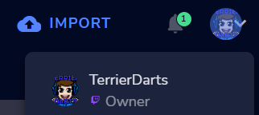

# Import Code
```
TlM0RR+LCAAAAAAABACtV1uP4jYUfq/U/4DmqVWXUa4MWbWVgOESLtkFhgRS9iGxTcjgXJoLEFb733uczDAhMO22KpJFYh9//s53znHsrz/+UKvd7UkUu4F/97EmfMg7fMsj8HZ3V7xaKIHhGHr+YO+12tfiD4ZczOwaioyalkXqjaZs16UGxnWlIaG6xCnNhiIp8kZsFlj5pD9TkjJ8P6X0rZf4lk0Jw0uilJT6j4immPSiwBu4cRJEGZhsLBqXbF4JG1aCtonrkdpTZPnxhkS1n+bdn0trO1GQhsz0c+D6SfxmN8/ihHglS4serCyepf71cjAHB14rl+V6FAU+SqOI+Mn12JWUF3Je+HJm9ubUpS+5NSYxitzwhcnbpGRLShOxlVi1DShYm3fvKwg7QsIWdffkim3hKwE44iNSIZ0Pdj6u14YLYhzi9XrioiiIg01yr3Wf1uteBI4cgmjXkNbrvXTP3YucyCvrtRejIKKufY8pveTyXxGL2OV4Zbgvl57YWUI6Ac7FxUsttD3kLER6wn09+XTgRtW+8U7b2/0jXYmz0Bbk03iHqe3pmWVMHh6nIY8EmppZ+4ksNc40uPTJ07kyDryLuK+kSFA83JFH8J+ycZh7wMYwBhxnJRy3SJw4C07f6EKPWwlbzjJ4CjawRuConZaDBrpr9+mz2oc66LQ3gMmtjINDsrZvLqcP6kCj+DF2NlOGXZnTPYZInDb1pUbRs+Rg9u9Pbs4t5l9zy+c63IgAd4atDtr8yjuGq6x9woNh7muO68lb21h8H6/Cl8QyZB60PqmD2DEF0A8wi7mc1vGhwbpvc7R4tdROalebzrs0hb7UnN7k5dqCEqtdXTINDfAXwWj6ahNrHbeVc2ENe72M8bSMqfN53t4iD58MruUiQR+anSEe09l+Ic4g5rI/6uzOMSmwzC1yGV+8xX0twH2amEs9szstRe0MAzyYHdAp2I+F3sGay0wruoLY2pBbpiFzKJOfbYHbWzCO+t09flb3qK+Etj87jTPVGTEtDLpTO7Gjuoq4Ws6erQHkorFwP736nLf2Sy62Al3Q3alwDBk+08sydNAZ+PRlirP20jSGj6Abtf1pMJrvLrQgF5hFQy++57Es5afZh+c5w31dQ+7aIoaYKFuzp3HIY3y2N7SpaFjwf5rpyrLknwP6l/1lscnrZwoNQw2y9cw85+gW/GmYC8W1PP0ZPx6rWL+MbnK/ycOzRdC9yM1QfeScCeSvNW81q/6PfR18G57YHoFBa8jbcJTF4Q3MG+tUtO3zEHOdA39Atx7sFybU6JCaLG4s1zvywFzOdNAk0yFfPw9e9D1JQUWntKhvzbZ0Li3VZAz5eK41yMOt7Wse8M9MY+qOO20O+TodPV3WRsmH0HRbgW2ALssZZbxXhnwyIQ7I03egE8sv3u4fbvj/fm6V8SEfHeDHndfIct/3ts+0mKZ6XxmCzWniVnJqLvNMF8Qn4XIun31835eiWUV98ExnVm+wT+xtb3ZiMZ/ybZXt9biXx9hYLdUms//892vnz7bXg/6Do/plOzVWB7MMG4vw03foAN8YEbBgb5B3uQ63eMKekOfpOXcmzshtCZOb9VVqRT49lfOpWh+vuW0IFL88p2zfGndabtlOdQ8VrgcHcos3b9bW/8fh3Tx0X9f/Zx6b6XUcyt+pUkwy4MkjTyowK3l1xim+V79VzlZhRFDghS5953CFCbWyeWJF10fFfLw4XvO4IWKpYdc5a9OsS8RCdcW2N3XeJkiQeCzJHK4sfCCus2Wg3D13OZJkISOjsN/lyPloXMF652BeEPQxOcII/9b77cN7J9u9FbkMSns54cZErfLeWzS/Gtz9OicJHFZr6mNtC+fP3+9uCvPQFBT80Kw3mwpXl6D069YG1OEkLG0ILzYIJ/9bYXhBvC3LxW3lu4XhSsK8Pn6p3gf6bIn8fP2lfI2g1ApjgkujxWAOVFgWd6nSVJjmeXA9ebX/9hd9gpY+4w0AAA==
```

# Installation
In Streamer.bot in select `Import` from the top left.
Copy the `Import Code` and paste it into the `Import String`.

Once the code is imported the next step is to make sure the code compiles this should be fine, however you may need to add `system.dll` to the references. 

The next step is to get your StreamElements id or Account Id as it is labeled on the StreamElements Site. This ID is on the users accounts page access in the top left and clicking on the user.


Then the final thing to do is to create a command that runs the action. 

 > Please note the code will only import the data of the users the bot has seen, so you may need to run it a few times once a month or so would be ideal 
 {.is-warning}

# Contributors
 - [<i class="mdi mdi-twitch"></i> GoWMan](https://www.twitch.tv/GoWMan)
 {.contributors}