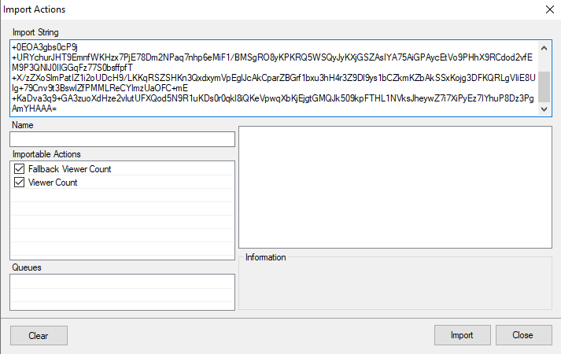

# Import Code

```text
TlM0RR+LCAAAAAAABADtVD1v2zAQ3Qv0PwgGspkFKVKW1K0I0CJLhhboEng4kadEKC25lGjHCPzfS4pWLMvuYBTpFA2S7oPHd/ce7uXjhyiabdC0VVPPPkds3jtqWKGzZrNgguxcuHWeB29H0Uv4uFClfJ5UIFJkQLgUnAhBEwIpRbIoy5QmSsRZxkOt/tBvi9bXr63WRy/WUGj09Tpj8egfwHwFrQuQv6KfFW7RRLeNrbtR1UfT2LVPvLVt16xcXOEoDHoLu/a79W2WoNvRDQZq1ay+9F2eR2VTS2sMusvOYmeTOZlOn9JKrPH+0EOA3gbs0cP9j+URYchurJHT9EmnfWKHzx7PjE78Dm2NPaq7nhp6eMiF1/BMSgRO8yKPKRQ5WSQyJyKXjGSZAsIYA75AiGPAycEtVo9PHhX9RCdod2vfEM9P3QNlJ0IIGGqFz77S0bsffpfT+X/zZXoSlmPatIZ1i2oUDcH9/LKKqRSZSHKn3QxdxymVpEglJcAkCparZBGrf1bxu3hH4r3Z9Dl9ys1bCZkmKZbAkSSxKojg3DFKQRLgVIiE8UIg+79Cnv9t3BswlZfPMMLReCYImzUaOFC+mE+KaDva3q9+GA3zuoXdHze2vlutUFXQod5N9R1uKDs0r0qkl8iQKeVpwqXbKjEjgtGMQJk509kpFTHL1NVksJheywZ7i7XiPyEz7IYhuP8Dz3PgAmYHAAA=
```

# Installation
In Streamer.bot in select `Import` from the top left.
Copy the `Import Code` and paste it into the `Import String`. 



Here are my two actions. Both of them are just pointing to same Text GDI in OBS.

Action called `Viewer Count` should be one inside event I already mentioned. You can find that event in SB under `Platforms`>`Twitch`>`Events`>`General`>`Present Viewers (occurs every 5 minutes)` (or you can put those subactions from `Viewer Count` into already existing Action if you already have one sitting there).

And second action called `Fallback Viewer Count` is being called from `Viewer Count` if variable `%viewerCount%` is not existing and changing our Text GDI to number 0 (or anything you change it to).

I know this is really basic, but hopefully it will help someone, who wants to use Streamer.bot only in their setup.

# Contributors

 - [<i class="mdi mdi-twitch"></i> MarkusoOoO](https://www.twitch.tv/MarkusoOoO)
 {.contributors}