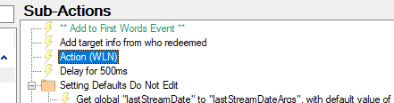

# Installation

There is no Import Code for this what you need to do is create a blank action called `WLN`, then in your current First Word Action you need to reference this action. It should look roughly like this.

The important Sub-Action is `Action(WLN)` as the pop-up will trigger when that Sub-Action runs. 

Next thing to do is to download the files, this contains all the files you will need for this overlay.
- [<i class="mdi mdi-file-document"></i> Windows Live Notification Download](../assets/windows-live/windows-live-notif.zip)
{.btn-grid .my-5}

Once download it will need extracting and putting somewhere safe. You will then need to add the index.html file contained to OBS. If all is done correctly it should run when someone chats for the first time in stream.

If it doesnt work, it maybe an issue with the Streamer.bot WebSocket, so please check it is active and it is 127.0.0.1 and port 8080. If these are different the script file may need editing.

# Contributors
 - [<i class="mdi mdi-twitch"></i> TerrierDarts](https://www.twitch.tv/TerrierDarts)
 {.contributors}
