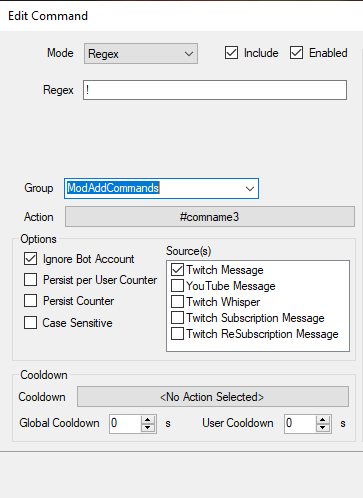

# Import Code

```
TlM0RR+LCAAAAAAABADtWVuTokgWft+I/Q+9tS+70UNHcoeJ2IfSEkWr7BYVla15IMkEabm44rUm+r/vSSgUL1VdNZeameg2AkUyOXku3/nOSfj573979+5qTRdZmCZXP74TfsgvJG5M4d/VVfHX9ZYwnMGV/7L/7979XPzAUEjYPKS7HhaoyukiL3CSxmucqyuEk2VeEwQVq6ooFLLym/63oismP1lF0eEqTVwcUSZvuVjRyvWtF60INRZp3AqzZbrYwRTfjbLKnFLhf7iEeGlcWStYpKs5G7pLyTUhlNTTOKuMu9HG3WXWKjkXunATksbXufHno16aeKvFgibL87Ezhx057dEq6q2WtJ4SauY+5CUeE0+nHPE9DD6kEqd7msJRjZc8VVYJz8sHvXMZMV1O0/xmsAzsikHhkymLVfIxGYaD6YK65EzRSgh9WdFUoiuc7KsaJ+lwpvOixFFMeAFJKqKIP5G9oWEwZdajD+h4ZLmbs3Do8NGOR8pwHIX+ufAXKiaEbtlCh6tfytOfTt3eZEvkvv+pGq0ocucZJZXRYvDLD5cx7ftUlWQZcwJyESdhBTCt6ITDnq9LmMeyoNK3wTQA2g8X2fI7qsspL0a1y0tAS0jneIxUQLWvcZruIU6QXRErvC5j2fumUK3xSIYgaBzPKz4nCZrM6TLyOZfXfcJjRVCkN2JqQHUUfgf1YcqLQS1hyRUUjXA+D/QkeTqAGvOI83gZiVT0dc3F3xSoCdEUXxd1zhM1qF08FjmX6jzn+bKIfewSQXPfBtSERt/bj8qUF2Na8USEBKxwIgSLk+DD6URXOUIlRVB9WeUF5ZvCtCR5CFPR5VQFviSEZc7VBArxIMj1fQwdNXobTFMSLr+DujLlxaCmvEtUpIoc9UXYFulI4lwVmkmf93xF8QVN8PRvCtQQConndQC1rEBPLQmIwzr8lWH7qEKKY6TjNwH1PwHQ7Fz8C6Aabk9oPq0ANXr8cBe+ys/VJTgKmu4iHXo/UVYkTnI1ntMU1+c8jXiUijp0x6+GoyRexuLV1euRyFeQ+MNT3viz5bgPOe5qgGakSCLwNDQgmqapnKqK2MWqTyT3NBq/Jsef9uslDS+k+F/GsURRVIZJzgXKgOVF2H8TjOELNm2+r2CkiX84eQpvSJ5YdDVfQxAPXdY5SfVc1hH4nKzwVBcBb8h9m61bhR8ZWt79azL491+ARy+oz/CZXbAhn09o5i3C+aMup4k3o3R+HYVrehnDC+pT0NSjJyrlg/Uf7+9HAKF0k93f34XeIs1Sf/mh2xjc3xsLUHOTLmaKdH+/lj6gDyISef3+Ps68dBGF+AOJomNdfqnE/i5b0vhDPV3QXGhV5k/H5uBdwQx5Yo67cxx7wVCMHkjTXn7coM7ptdvZdo6ThnrTm/OeEK2cXW1Ax13kjNCqJ+gZbtqfSTNa4+RuZQn2yhm355OHrFsPUMdr2SFuRp/NZjebjLsPZqPb6zeiFVxbOT3UobCeWb8OzFaNn8Tb+WRXCzHINBvGzGl013jET3HcSzu9ch7IDeG3XhyeaO3ckZyYLfZLEmdsBp/6takXk4fRrg1613hycx2O+/IQ813kxUz/YH4bWetBUxdhftoZHMu83elzJ6x9xgK/nIzk2RhsBjvQXb0W0Sb4pHUXkOY0wmFthne1FRatlOlw00v3MsyWM/UKGZ9d8I+7u9Zz2+tyyxlbLdzUw8loO5qMTa204VMYzMy4tNnyqVja1NbNcBOQVpt3+jP1aJ1mFJv16dE6YP+KjLbZ3mf5UTu+r7gGtrTzWE8EfYlFG5k3KJiM24nHZ6EXG2J/JG/IuHfmv4+bquziABvQYxwyZySxOLD5iSPYO8BQhGPY7dwc+7rwVSm3tiZjC9azwB4E91+npV63UTvCI11w+sHmtl7IBdytOqf+KOy6GTaC1VCwkSVs15PYyOzY2HXqvTCXNzJWjqGrzHZHIJGXoBBkVtfOmB1kNLxoZ4+vmbdRF+yxHNBtSEbtaDCyHzzBSEC/mTnb4zY4imFzOvUA387IXplNwHfTnpk30nsq6DwB/JMm3DdG4Ske86OxnXtir4KVHFuZC3nIYpbrNCMRaZAMC+0pNgB/n7d3bPxT6d8H6X2n3mb3+ZjhuG4+a2fuq3yeXHOavXTvr/A1Pj9Zj9k4ym15dm0vthEZt1ePc47Xa6Ej/zij7YPzdayX+kHsozWxLeAbu+sAJ01GJAI9b8p8B+7JYP2p05oF1ngKuloP5mWbd5DLvBdLRW6exM3fcxbKufAyz3V3zshAznCf93nMOvXZo6wTWw68so89jm3xHB+nOfpbxec1fszlBP2mAbzfjhgnsPVNw96c+bPVjkjL3gGnIi+xo/2az/nOqPG4ud2vN8htCOalXHqs92kuVPD9NDfnMm+2JU++B7/mHDIWctvCnItA39Oc3del3J+Q32yNg29XPeAEwFgyGVvgs6kEcuROH7g7rElmPQsY35vh9cJszV7n//16v4F/G1YEHFvB5tvWYQL4LHzWTZ1Rd/EMz+3j8xWOvxgrdzQJOtV16g2IlQzY2syPfXiJl3Pc2DjpHuv0S2r5H4DTooc44HIY21BvHcCRsXPELjbjsvdpExar4WOcgZ+erY0nvjjVZc9fz+pV2DpwILdHgGkbeklnyEee2J06wjBtV7mmtdz3Gn6/lk7GdwHkRd6jQX2ICKu1v4bDi7kRbnWjF2LiSb2r/YHV1CNPgL6pYUs5n/9udcaeuWNr76+n68u+F9v7s9oTukU/uDEjtLKb+uARb2mH5TXargnM75xyT11bsxyr5GXJB4FT1teWlbL64DQ1qGc6ctn+4Jj3BMB5LmMiTKOJkDF+ybnQOqlpldxhGDn08WIVI0/1PjXo/Yu+s1zHHECNTewM7312faG+PMf7j7mUtKcEFfl05r+LeQm7+Eqvy+Jw6MHkO8BXQprBs309653Zeswedv+hPsh9Z8SvSTxM7+qbR7nQo4evyutnOa669hvkOe81rSl5TU/9VE0sfKgf77PszBOGX43/V/YGYa/MgXqtgQX7AYdkn/vezvwVvXCub3m+gXUzd8R8o68x9Ayl/3oFpr+NOn6DXl7HD1iIJ2w/8VvUgRfii8kuzw/PS9prLGyCPV4aj3h+ur893svnGKtwz9N1/KnnCTleAMsIuB95PJkD16RlHTiscd4XvOC5w17+gZPyenjoP26us4Pu+/Fz3JXPFc76kWo+PIvtiq1PY/jA63te+r3qT4zFdjQBDEMc9jElgr4DzpgDlpZlrw+x2QBWYK/oRe3d7BTj7DnWYNjYtu16bTzg243hrmYPG/pHsz68VGtY3PM8v2X9SWJNwd6HvmDLnRZZe3FvbtYnMMcoa9aqP+5+ZM+ZBmLbwOMaov2pCLrPOv3ZhVy4kB/Fsb5FXdMadm/NRtSEYwh61kzDqQ0aUQP24n2Lt7vWUB7CHtIxjW79HE/Fgfc8y3C/jxPDFPjJ+Mz4t903g86ulutZ7LOGjE8KfhOZndaL+lzwbd+ya3e9YdcwDdK2G0FgN6bGkb7MBsM2SrvgGJiNRmDPjLv+sBf07HbLHvLGIOpd8Bc6458ju79SMw++eMU+MEH/OXkwPl9QL43nYfTEk3FCI3fXX7qL86f4+Xj4S18+vejtj/6nf3XOfoqZxSucyq1wW/HK4nH+l/8DX0DkKL8tAAA=
```


# Installation
In Streamer.bot in select `Import` from the top left.
Copy the `Import Code` and paste it into the `Import String`.

In the single bit of code you will need the following references.
```
mscorlib.dll
System.Core.dll
```
You will also need to set up the following commands. All these commands are tied to the action of the same name.
```
!addcom
!editcom
!delcom
!comlist
!comfirst
```
The final command you will need to set up is a Regex Commands.

```
!  = Tied to #comname3
```

Once all commands are setup you will need to do `!comfirst` but you will only need to do this once, this is just to set up the list of commands for when a user does `!comlist`.
# Example Usage
## When adding a command
```
!addcom hug %user% gave %targetUser% a hug.
```
## When editing commands
```
!editcom hug %user% gave %targetUser% a MASSIVE hug.
```
## When deleting commands
```
!delcom hug
```

> It's important to note that when you add commands you don't put the '!' for the trigger. You will need to put (for example) "hug" and not "!hug".
{.is-danger}

> When using !comlist, please be aware that twitch has a character limit so if you have too many it may not post.
{.is-info}

# Contributors

- [<i class="mdi mdi-twitch"></i> TerrierDarts](https://www.twitch.tv/terrierdarts)
- [<i class="mdi mdi-twitch"></i> Farlezz](https://www.twitch.tv/Farlezz) 
{.contributors}