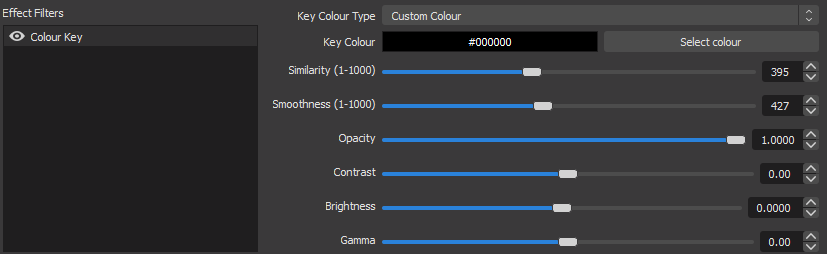

# Fireworks (by [Nate1280](https://www.twitch.tv/nate1280), [VRFlad](https://www.twitch.tv/vrflad) and [Caleb Miller](https://codepen.io/MillerTime) on Codepen)

## Description

To celebrate the new years, please find a Fireworks system for the awesome streamer bot!
Originally on [Codepen](https://codepen.io/MillerTime/pen/XgpNwb) and modified a lot by Nate1280 and I put in final touches

## Implementing into Streamer Bot

Just ensure you have the websockets enabled!

## Adding into OBS

Unzip [fireworks.zip](/fireworks/files/fireworks.zip) to a folder that you want.
Add in the fireworks.html as a browser source.
Add a Colour Key (or Color key if you spell it that way) filter on the source with the settings below

Set audio up (by modifying advanced audio properties for the browser source)

## Usage

How to trigger the fireworks?

Simply have chat type in ``fireworks`` as part of the message and it will trigger.
